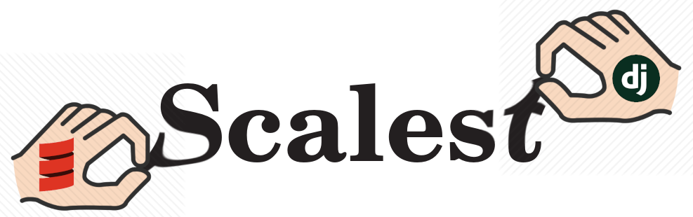
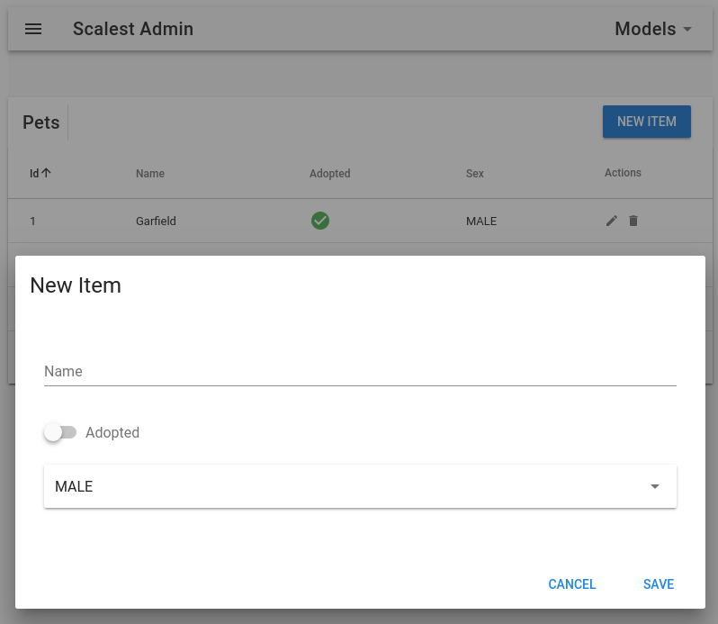
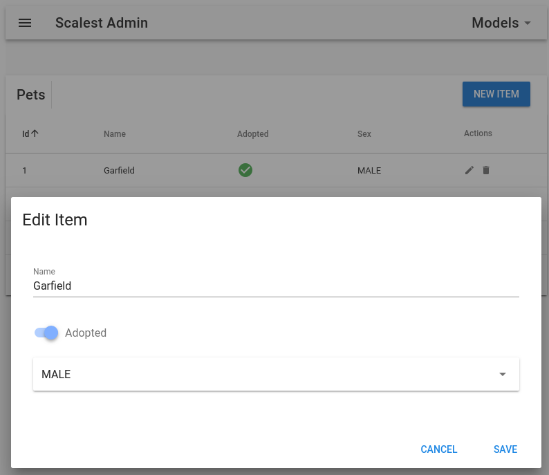

## Description
Scalest is Productivity-oriented Scala Web framework inspired by Python Django and based on Akka. 
The main problem it tries to solve is faster creation of web applications with more focus on 
business domain rather than on writing routine CRUD code and UI for working with it.

## Preview
This piece of code creates admin routes for your Models:
```scala
  val adminExtension = new AdminExtension(
    List(
      new ModelAdmin(
        "pet",
        List("id" -> intIdMV, "name" -> strMV, "adopted" -> boolMV, "sex" -> enumMV[Sex]),
        petRepository
      )
    )
  )
```

>Item list:


>Create item:



>Edit item:



## Modules
- Core - main building blocks of Scalest application
- Admin - automatic admin panel for Models
- Admin-Slick - Admin extension for Slick Tables
- Examples - example applications using Scalest